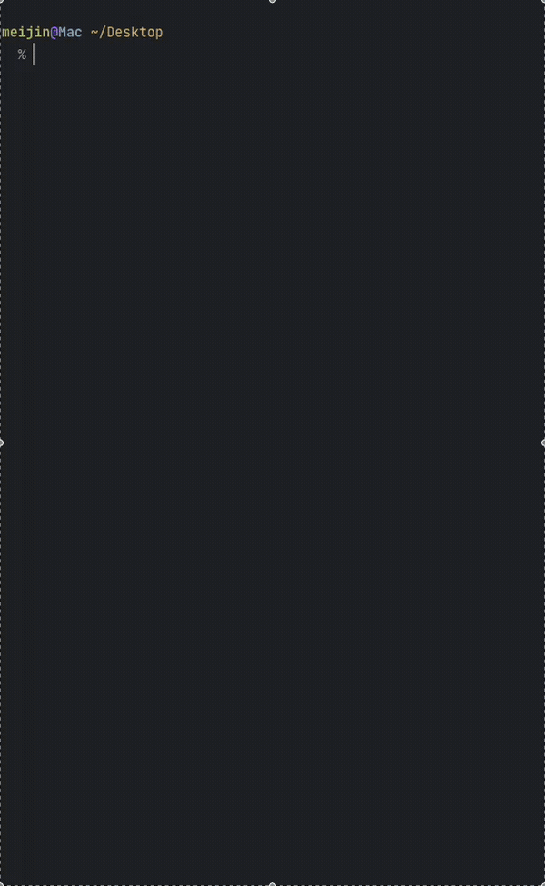

<div align="center">

# ghostty-theme

**Switch [Ghostty](https://ghostty.org) themes from your terminal — with fuzzy search, favorites, and random mode.**

[](https://www.npmjs.com/package/ghostty-theme)
[](./LICENSE)

<br>



<br>

</div>

## Install

```bash
npm install -g ghostty-theme
```

> **Requires**: [Ghostty](https://ghostty.org) terminal installed and available in your `PATH`.

## Usage

```bash
ghostty-theme              # Browse favorites interactively
ghostty-theme list         # Same as above
ghostty-theme list --all   # Browse all available themes
ghostty-theme set <name>   # Set theme directly by name
ghostty-theme random       # Random theme from favorites
ghostty-theme random --all # Random theme from all themes
ghostty-theme add <name>   # Add a theme to favorites
ghostty-theme add -c       # Add the current theme to favorites
ghostty-theme remove       # Remove a theme from favorites (interactive)
```

### Interactive Selector

Running `ghostty-theme` opens a fuzzy-searchable theme picker:

- **Type** to fuzzy search
- **↑↓** or **j/k** to navigate
- **Enter** to apply
- **q** / **Esc** to cancel
- Active theme is marked with `*`

### Favorites

Your favorite themes are stored in `~/.config/ghostty-theme-cli/favorites.json`. On first run, a curated set of popular dark themes is added automatically:

> Cobalt2, TokyoNight, Dracula, Catppuccin Mocha, Nord, Gruvbox Dark, Solarized Dark Higher Contrast, Atom One Dark, Ayu, Kanagawa Dragon, Rose Pine, Everforest Dark Hard

### Random Mode

Shuffle through your favorites (or all themes) with a single command:

```bash
ghostty-theme random       # Pick from favorites
ghostty-theme random --all # Pick from everything
```

It always picks a different theme from the one currently set.

## How It Works

1. Reads available themes via `ghostty +list-themes`
2. Directly edits the `theme = ...` line in your Ghostty config (`~/.config/ghostty/config`)
3. Ghostty live-reloads, so theme changes apply instantly — no restart needed

You can override the config path with the `GHOSTTY_CONFIG_PATH` environment variable.

## License

MIT
